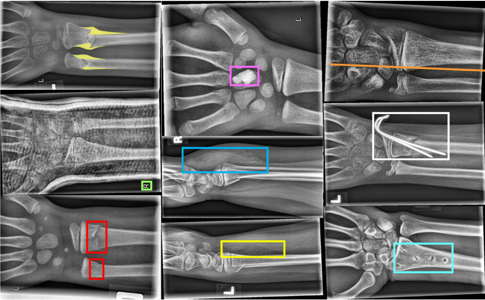
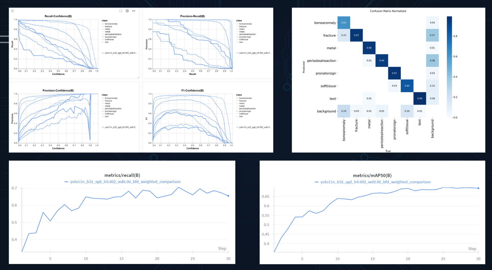
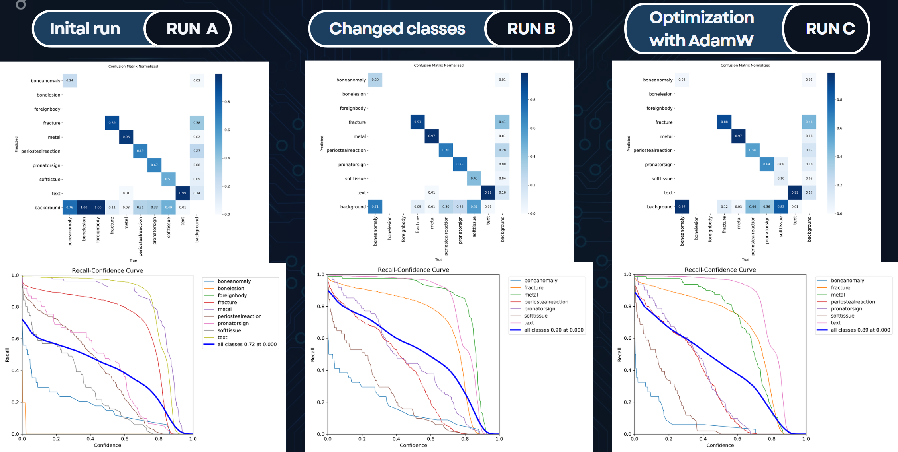
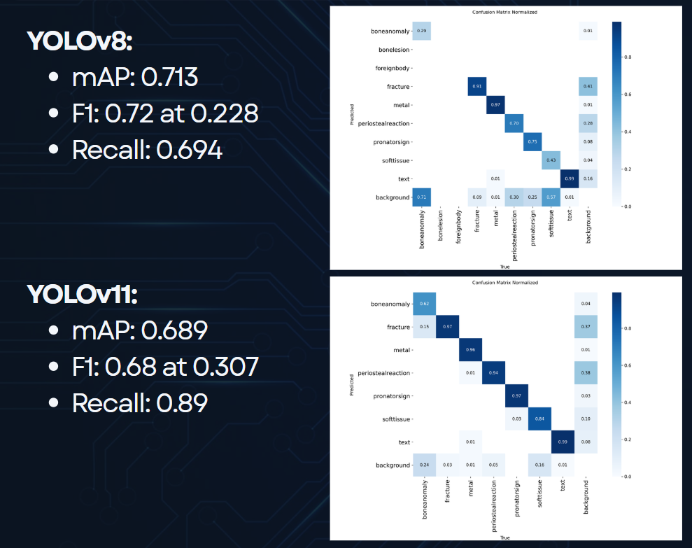

# Bone_Fracture_Detection

## Project Overview
This project investigates the use of YOLOv8 and YOLOv11 for automatic detection of pediatric wrist fractures in X-ray images. The aim is to improve clinical fracture localization while handling class imbalance and maintaining high precision and recall.

**Key Features:**
- Detection of fractures and other relevant skeletal features.
- Comparison of YOLOv8s and YOLOv11n models.
- Evaluation against previously reported literature.
- Techniques to handle class imbalance, including weighted datasets and loss modifications.

---

## Experiments and Results

### YOLOv11
*Author: Igor Starikov*

- Baseline: YOLOv11n, 640px.
- Modifications:
  - Hyperparameter tuning (SGD, batch 32, lr 0.001)
  - Focal-SIoU loss for bounding box regression
  - Weighted dataset for rare classes
- Best model: new_weight-2, 1024px, recall 0.6546, mAP50 0.6937.

---

### YOLOv8 s
*Author: Nils Pudenz*

- Baseline: 9 classes, 640px resolution.
- Optimized: 7 classes (rare classes removed), resolutions up to 1024px.
- Best model: SGD optimizer, 1024px, recall 0.7295, mAP50 0.7261.

---

## Evaluation

### YOLOv8 vs YOLOv11
- YOLOv8 achieves higher recall (0.730 vs 0.655) and comparable precision.
- YOLOv11 benefits from weighted dataset and higher resolution, improving detection of rare classes.
- Both models are competitive with prior literature; top results in literature show higher mAP50 (up to 0.968) but under different datasets or architectural enhancements.

---

## Conclusion
- YOLOv8 and YOLOv11 can effectively detect pediatric wrist fractures.
- Weighted datasets and Focal-SIoU loss help handle class imbalance.
- YOLOv8s shows slightly higher recall, YOLOv11 shows potential with further tuning.
- The project demonstrates clinically relevant detection capabilities in X-ray imaging.

---